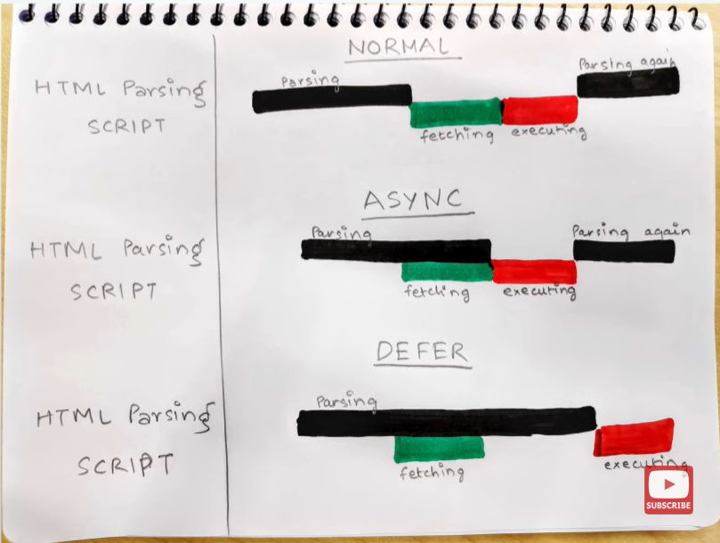

Chapter 01 - Inception  
 Theory - 
 ●   What is Emmet?
 --> Emmet helps in during coding by there suggestion or easly used Shortcuts 

 ●   Difference between a Library and Framework? 
 --> Library is a Collection of codes where we difine differnt type of function or Methods  
     we just import any library to our code and use there Pre defined functions and calls those function       
     whenever we wants.
                  &&
 --> Whereas in Framework , It is a software that is use to develope differnt types of application e.g anguler,vue

 ●   What is CDN? Why do we use it?
 --> It's stand for content deleivery network that means a main server where all the files are stored and whenever 
     we needs these file just import from there , it is easy to use ,It has faster loding time ,Its reduce the server
     load that's why we use it.

 ●   Why is React known as React? 
     Caues it's only change where user wants not the whole files

 ●   What is crossorigin in script tag? 
 ●   What is diference between React and ReactDOM 
 --> React is use to target all the methods related to react whereas reactDOM is used to target the DOM related 
     Methods

 ●   What is difference between react.development.js and react.production.js files via CDN?
 -->  one is uesd for development and another one is used for Production

 ●   What is async and defer? - see my Youtube video 
     </img>
 References: 
 -   https://beta.reactjs.org/apis/react/createElement 
 -   https://www.youtube.com/watch?v=IrHmpdORLu8 
